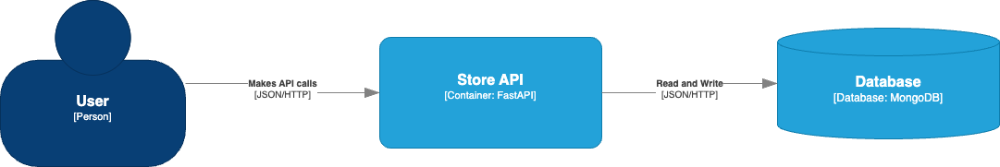

## TDD STORE

Neste desafio foi mostrado como criar testes unitários e de integração utilizando pytest. Foi criada uma API utilizando FastAPI e um container Docker para subir o banco de dados Mongo. O arquivo Docker foi alterado com a adição do Mongo Express, que permite conectar no banco Mongo utilizando uma interface Web.


## O que é TDD?
TDD é uma sigla para `Test Driven Development`, ou Desenvolvimento Orientado a Testes. A ideia do TDD é que você trabalhe em ciclos.

### Ciclo do TDD


### Vantagens do TDD
- entregar software de qualidade;
- testar procurando possíveis falhas;
- criar testes de integração, testes isolados (unitários);
- evitar escrever códigos complexos ou que não sigam os pré-requisitos necessários;

A proposta do TDD é que você codifique antes mesmo do código existir, isso nos garante mais qualidade no nosso projeto. Além de que, provavelmente se você deixar pra fazer os testes no final, pode acabar não fazendo. Com isso, sua aplicação perde qualidade e está muito mais propensa a erros.


## INSTALAR O PPYENV NO WINDOWS

Abrir o PowerShell como administrador

Executar os seguintes comandos:

```
Set-ExecutionPolicy -ExecutionPolicy RemoteSigned -Scope LocalMachine

Invoke-WebRequest -UseBasicParsing -Uri "https://raw.githubusercontent.com/pyenv-win/pyenv-win/master/pyenv-win/install-pyenv-win.ps1" -OutFile "./install-pyenv-win.ps1"; &"./install-pyenv-win.ps1"
```

## Instalar o pyenv-win-venv

Abrir o PowerShell como administrador

Executar o seguinte comando:

```
Invoke-WebRequest -UseBasicParsing -Uri "https://raw.githubusercontent.com/pyenv-win/pyenv-win-venv/main/bin/install-pyenv-win-venv.ps1" -OutFile "$HOME\install-pyenv-win-venv.ps1";
&"$HOME\install-pyenv-win-venv.ps1"
```


## POETRY

Instalar o Poetry de forma global

```
pip install poetry
```

Criar o projeto utilizando o Poetry

```
poetry new <<nome_do_projeto>>
```

Entrar dentro da pasta e criar o ambiente virtual

```
pyenv local 3.9.13
```

Editar o arquivo criado pelo Poetry na raiz do projeto (pyproject.toml) e trocar a versão do Python pela mesma versão utilizada para criar o ambiente virtual 

rodar o comando poetry add para adcionar cada pacote que será utilizado neste projeto

```
poetry add fastapi
poetry add uvicorn
poetry add pydantic
poetry add pydantic-settings	
poetry add motor
poetry add pytest
poetry add pytest-asyncio
poetry add pre-commit
poetry add httpx
```

## Pre-commit

Antes de rodar o comando abaixo

```
poetry run pre-commit install
```

precisa criar o repositorio do git na raiz do projeto, executando o seguinte comando:

```
git init
```

## DOCKER 

No Windows, abrir primeiro o Docker Desktop. Depois, rodar o seguinte comando no terminal

```
docker-compose up -d
```

Para verificar se os containers estão ativos:


```
docker ps para conferir se subiu
```

Para encerrar a execução do container:

```
docker-compose down
```

No Docker foi instalado além do banco de dados Mongo a imagem  do Mongo Express. Ela permite que você conecte no banco de dados Mongo utilizando uma interface web. Para abrir o Mongo Express, acesse o seguinte endereço

http://localhost:8081

## rodar o projeto

No terminal dentro do VScode, foi utilizado o seguinte comando

```
uvicorn tdd_project.main:app --reload
```

Para testar no navegador:
http://127.0.0.1:8000/
e 
http://127.0.0.1:8000/docs (Swagger)


Observação. O comando "make run" não funcionou no Windows. Seguir este passo a passo para instalar
https://medium.com/@samsorrahman/how-to-run-a-makefile-in-windows-b4d115d7c516


## Solução Proposta
Desenvolvimento de uma aplicação simples a partir do TDD, que permite entender como criar tests com o `pytest`. Construindo testes de Schemas, Usecases e Controllers (teste de integração).

### Arquitetura
||
|:--:|
| Diagrama de C4 da Store API |

### Banco de dados - MongoDB
||
|:--:|
| Database - Store API |


## StoreAPI
### Diagramas de sequência para o módulo de Produtos
#### Diagrama de criação de produto


#### Diagrama de listagem de produtos


#### Diagrama de detalhamento de um produto


#### Diagrama de atualização de produto


#### Diagrama de exclusão de produto


## Repositorio original do projeto

https://github.com/digitalinnovationone/store_api/


## Testes

os testes dos models são chamados de unitários
Os testes de controllers são chamados de testes de integração!


## Desafio Final

* Create
Mapear uma exceção, caso dê algum erro de inserção e capturar na controller 
* Update
Modifique o método de patch para retornar uma exceção de Not Found, quando o dado não for encontrado
a exceção deve ser tratada na controller, pra ser retornada uma mensagem amigável pro usuário 
* Update
ao alterar um dado, a data de updated_at deve corresponder ao time atual, permitir modificar updated_at também 
* Filtros
* cadastre produtos com preços diferentes 
* aplique um filtro de preço, assim: (price > 5000 and price < 8000) 

## Links uteis de documentação
[mermaid](https://mermaid.js.org/)

[pydantic](https://docs.pydantic.dev/dev/)

[validatores-pydantic](https://docs.pydantic.dev/latest/concepts/validators/)

[model-serializer](https://docs.pydantic.dev/dev/api/functional_serializers/#pydantic.functional_serializers.model_serializer)

[mongo-motor](https://motor.readthedocs.io/en/stable/)

[pytest](https://docs.pytest.org/en/7.4.x/)
